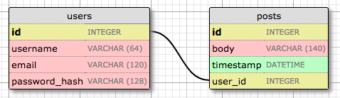

## Chapter 4
## 2023-12-29

### Database
https://blog.miguelgrinberg.com/post/the-flask-mega-tutorial-part-iv-database

For the vast majority of applications, we will need to persist and retrieve data - so we need a database.

#### Databases in Flask

- Of note, Flask doesn't support databases natively. This is by design, to allow the user to choose a database that best fits their needs rather than being forced to adapt to one.
- Databases generally separate into two categories: relational and non-relational (often referenced as NoSQL).
- Structured data (users, blogs, posts, etc.) generally fits well with relational databases, which we will move forward with.
- In the previous chapter we used a Flask extension, `flask-wtf` for working with web forms. In this chapter we will use two more: `Flask-SQLAlchemy` and `Flask-Migrate`
  - `Flask-SQLAlchemy`: Flask friendly wrapper to the popular SQLAlchemy package, which is an ORM (Object Relational Mapper)
    - **ORMs allow applications to manage a database using high-level entities like classes, objects and methods instead of tables and SQL. An ORM exists to translate high-level operations into database commands**
    - The nice thing about SQLAlchemy is that it supports multiple database engines (e.g. MySQL, SQLite, PostgreSQL). This is nice because you can develop with something like a SQLite database (which doesn't need a server) then when it's time to deploy to production you can switch to a more robust database like MySQL or PostgreSQL without having to alter your application
    
#### Database Migrations

- `Flask-Migrate`: Flask wrapper for Alembic, a database migration framework for SQLAlchemy
- While setting up `Flask-Migrate` adds some overhead work, it is worth it for the ability to more easily make changes to your database in the future.

#### Flask-SQLAlchemy Configuration

- During development, we will use a SQLite database. The advantage here is that SQLite databases are a single file and don't need a database server running like MySQL & PostgreSQL do.
- Add new configuration item to `config.py`

```python
# config.py: Flask-SQLAlchemy configuration

import os
basedir = os.path.abspath(os.path.dirname(__file__))

class Config(object):
    # ...
    SQLALCHEMY_DATABASE_URI = os.environ.get('DATABASE_URL') or \
        'sqlite:///' + os.path.join(basedir, 'app.db')
```
- Flask-SQLAlchemy takes the location of the application's database from the `SQLALCHEMY_DATABASE_URI` configuration variable. As we did with `SECRET_KEY` it is a good practice to set configuration from environment variables, and provide a fallback value when the environment does not define the variable.
- In the example above we are taking the database URL from either the `DATABASE_URL` environment variable, and if that isn't defined, we configure a database named `app.db` located in the main directory of the application, which is stored in the `basedir` variable.
- In the application, we will represent the database as a database instance. The database migration engine will also have an instance. We create these objects are creating the application in the `app/__init__.py` file.

```python
# app/__init__.py: Flask-SQLAlchemy and Flask-Migrate initialization

from flask import Flask
from config import Config
from flask_sqlalchemy import SQLAlchemy
from flask_migrate import Migrate

app = Flask(__name__)
app.config.from_object(Config)
db = SQLAlchemy(app)
migrate = Migrate(app, db)

from app import routes, models
```
We make three changes here (notice, there is a pattern here of how to work with Flask extensions)
- 1, we added a `db` object, which represents the database
- 2, we added a `migrate` object, which represents the database migration engine
- 3, we import a new module called `models`, this will define the structure of the database
 
#### Database Models

Q: How we store data in an application? For this example, let's say we don't want to write SQL directly.

A: In a database, which we will represent by a collection of classes - commonly called _database models_. The ORM layer within SQLAlchemy will handle translating and mapping objects from these classes into rows in actual database tables.

Q: Given a `users` table with the fields: `id`, `username`, `email`, and `password_hash`, what is the purpose of the `password_hash` field?

A: Applications should not store passwords as clear text based on security best practices. Instead of writing passwords directly into the database, we will write `password_hash`es. We will handle how to do this in a later chapter. 

Q: As part of our database model for the application, define a `Users` class with `sqlalchemy`.

```python
# app/models.py: User database model

from typing import Optional
import sqlalchemy as sa
import sqlalchemy.orm as so
from app import db

class User(db.Model):
    id: so.Mapped[int] = so.mapped_column(primary_key=True)
    username: so.Mapped[str] = so.mapped_column(sa.String(64), index=True,
                                                unique=True)
    email: so.Mapped[str] = so.mapped_column(sa.String(120), index=True,
                                             unique=True)
    password_hash: so.Mapped[Optional[str]] = so.mapped_column(sa.String(256))

    def __repr__(self):
        return '<User {}>'.format(self.username)
```
- `sqlalchemy`: module includes general purpose database functions and classes such as types and query building helpers.
- `sqlalchemy.orm`: provides support for using models
- `db.Model`: base class for all models from `Flask-SQLAlchemy`
- `so.Mapped[str/int]`: fields are assigned a type using Python _type hints_ wrapped with SQLAlchemy's `so.Mapped` generic type. In addition to defining the type of the column, this type declaration also makes values required (aka non-nullable). For a column to be allowed to be nullable, the `Optional` helper from Python is added, as shown in the `password_hash` field.
- `so.mapped_column()`: defining table column requires more than just the type. This function allows additional configuration to be applied to each column.
- `__repr__()`: this method tells Python how to print objects of this class, which will help with debugging.

#### Creating The Migration Repository

- We will use Flask-Migrate (Alembic) to handle changes to the database as the application grows. Alembic maintains a _migration repository_ which is a directory that holds all migration scripts. Each time a change is made to the database schema, a migration script is added to the repository with the details of the change.
- To apply the migrations to a database, the migration scripts are executed in the sequence they were created.
- Start everything off with `flask db init`

#### The First Database Migration

- You can create a database migration manually or automatically. To do it automatically, Alembic compares the database schema as defined by the database models, against the actual database schema currently configured in the database. It then creates a migration script with the necessary changes to make the database schema match the application models. For our case, since there is no previous database, the automatic migration will add the entire `User` model to the migration script.
```commandline
(venv) ➜  microblog git:(main) flask db migrate -m "users table"
INFO  [alembic.runtime.migration] Context impl SQLiteImpl.
INFO  [alembic.runtime.migration] Will assume non-transactional DDL.
INFO  [alembic.autogenerate.compare] Detected added table 'user'
INFO  [alembic.autogenerate.compare] Detected added index ''ix_user_email'' on '('email',)'
INFO  [alembic.autogenerate.compare] Detected added index ''ix_user_username'' on '('username',)'
  Generating /Users/anthony/workspaces/flask-mega-tutorial-2024/microblog/migrations/versions/e62a92a5100e_users_table.py ...  done
```
- The `flask db migrate` command does not make any changes to the database, it just generates the migration script. To apply changes to the database we need to run `flask db upgrade`
```commandline
(venv) ➜  microblog git:(main) ✗ flask db upgrade
INFO  [alembic.runtime.migration] Context impl SQLiteImpl.
INFO  [alembic.runtime.migration] Will assume non-transactional DDL.
INFO  [alembic.runtime.migration] Running upgrade  -> e62a92a5100e, users table
```
- Of note, the `upgrade` command will detect that a database does not currently exist and it will create it (SQLite file `app.db`, this is the SQLite database). When working with other databases like MySQL and PostgreSQL, we will need to create the database in the database server before running `upgrade`.

#### Database Upgrade and Downgrade Workflow

- Upgrade `flask db upgrade` and Downgrade `flask db downgrade` as necessary
 
#### Database Relationships

- Expand the database to store blog posts to see relationships in action 

- What is a foreign key? The `user_id` field in the `posts` table is a foreign key. **A foreign key is a field that reference a primary key of another table.**
- In this example, the relationship of `user.id` to `posts.user_id` is one-to-many as one user can write many posts.
```python
# app/models.py: Posts database table and relationship

from datetime import datetime, timezone
from typing import Optional
import sqlalchemy as sa
import sqlalchemy.orm as so
from app import db

class User(db.Model):
    id: so.Mapped[int] = so.mapped_column(primary_key=True)
    username: so.Mapped[str] = so.mapped_column(sa.String(64), index=True,
                                                unique=True)
    email: so.Mapped[str] = so.mapped_column(sa.String(120), index=True,
                                             unique=True)
    password_hash: so.Mapped[Optional[str]] = so.mapped_column(sa.String(256))

    posts: so.WriteOnlyMapped['Post'] = so.relationship(
        back_populates='author')

    def __repr__(self):
        return '<User {}>'.format(self.username)

class Post(db.Model):
    id: so.Mapped[int] = so.mapped_column(primary_key=True)
    body: so.Mapped[str] = so.mapped_column(sa.String(140))
    timestamp: so.Mapped[datetime] = so.mapped_column(
        index=True, default=lambda: datetime.now(timezone.utc))
    user_id: so.Mapped[int] = so.mapped_column(sa.ForeignKey(User.id),
                                               index=True)

    author: so.Mapped[User] = so.relationship(back_populates='posts')

    def __repr__(self):
        return '<Post {}>'.format(self.body)
```
- Why do we index on the `timestamp` field?
  - It may be useful to index on the `timestamp` field in case we want to efficiently retrieve posts in chronological order.
- What are these new `User.posts` and `Post.author` fields for?
> The User class has a new posts field, that is initialized with so.relationship(). This is not an actual database field, but a high-level view of the relationship between users and posts, and for that reason it isn't in the database diagram. Likewise, the Post class has an author field that is also initialized as a relationship. These two attributes allow the application to access the connected user and post entries.
- What is the difference between `so.Mapped` and `so.WriteOnlyMapped`?
  - ... 

#### Playing with the Database

```python
>>> from app import app, db
>>> from app.models import User, Post
>>> import sqlalchemy as sa
```
> For Flask and its extensions to have access to the Flask application without having to pass app as an argument into every function, an application context must be created and pushed.

Q: What is an _application context_?
- ...

```python
>>> app.app_context().push()
```
> The application context that was pushed above allows Flask-SQLAlchemy to access the Flask application instance app without having to receive it as an argument. The extension looks in the app.config dictionary for the SQLALCHEMY_DATABASE_URI entry, which contains the database URL.

> Now let's add a blog post:
```python
>>> u = db.session.get(User, 1)
>>> p = Post(body='my first post!', author=u)
>>> db.session.add(p)
>>> db.session.commit()
```
> I did not need to set a value for the timestamp field, because this field has a default, which you can see in the model definition. And what about the `user_id` field? Recall that the `so.relationship` that I created in the Post class adds an author attribute to posts. I assign an author to a post using this author field instead of having to deal with user IDs. **SQLAlchemy is great in that respect, as it provides a high-level abstraction over relationships and foreign keys**.


```python
>>> # get all posts written by a user
>>> u = db.session.get(User, 1)
>>> u
<User john>
>>> query = u.posts.select()
>>> posts = db.session.scalars(query).all()
>>> posts
[<Post my first post!>]

>>> # same, but with a user that has no posts
>>> u = db.session.get(User, 2)
>>> u
<User susan>
>>> query = u.posts.select()
>>> posts = db.session.scalars(query).all()
>>> posts
[]
```
Note how in the first two examples above the relationship between users and posts is used. Recall that the User model has a posts relationship attribute that was configured with the WriteOnlyMapped generic type. This is a special type of relationship that adds a `select()` method that returns a database query for the related items. The `u.posts.select()` expression takes care of generating the query that links the user to its blog posts.

**Shell Context**

- `flask shell` is used to start a Python interpreter in the context of the application, e.g.

```python
(venv) $ python
>>> app
Traceback (most recent call last):
  File "<stdin>", line 1, in <module>
NameError: name 'app' is not defined
>>>

(venv) $ flask shell
>>> app
<Flask 'app'>
```

In a regular interpreter session, `app` is unknown unless explicitly imported. When using `flask shell` the command pre-imports the application instance, and pushes its application context for you.

One cool you thing you can do is to augment and also configure a "shell context", which is a list of other symbols to pre-import.

```python
import sqlalchemy as sa
import sqlalchemy.orm as so
from app import app, db
from app.models import User, Post

@app.shell_context_processor
def make_shell_context():
    return {'sa': sa, 'so': so, 'db': db, 'User': User, 'Post': Post}
```

Q: What does the `@app.shell_context_processor` decorator do?
A: The decorator registers the function as a shell context function. When `flask shell` runs, it will invoke this function and register the items returned by it in the shell session.